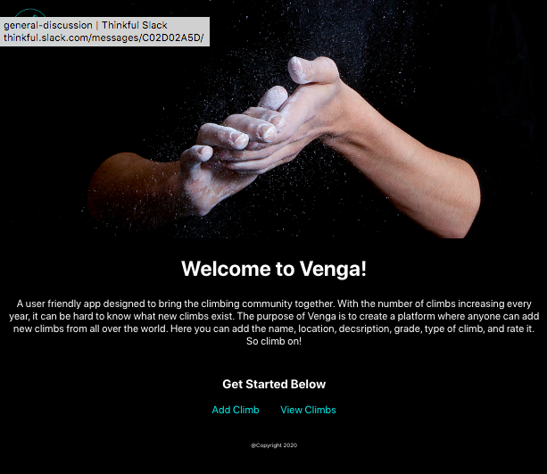
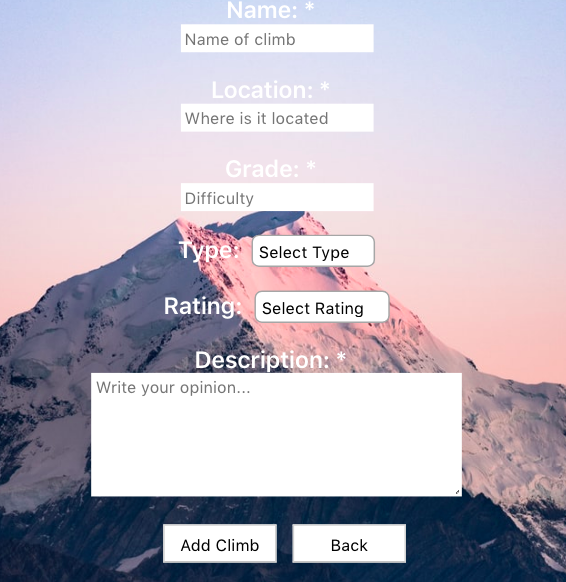
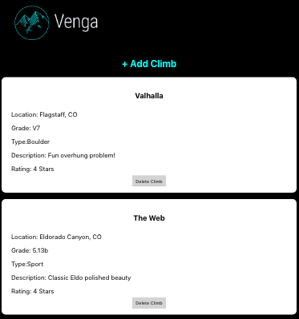

# Venga 
#### Created by: Andrea Bender
View live: [venga.now.sh](https://venga.now.sh)

# Technologies Used

### Client Side:  
React | Javascript | Zeit |  HTML | CSS

### Server Side:
Express.js | Node.js | PostgreSQL | Heroku

# Introduction
Venga is a functional user friendly application for avid climbers that want to contribute to the climbing community!   

# Landing Page

# Add Climb Page

The add climb form is displayed with various fields for the user to input information about the climb as well as a rating and description of the climb.

# Climb List Page

[Client](https://github.com/andrea-bender/venga-client.git) |
[Server](https://github.com/andrea-bender/venga-app.git)

Getting Started
Installing
Clone the repository and download dependencies.

$ git clone https://github.com/andrea-bender/venga-client.git
$ cd venga-client
$ npm install
Launching
Start the development server.

$ npm run start

Testing
Run tests
$ npm run test
